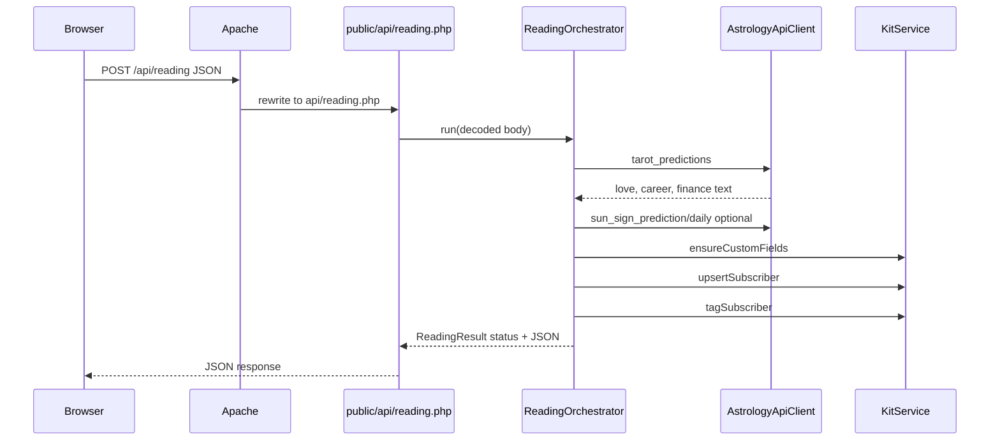

# Architecture — Soul Mirror Reading (PHP)

## Goals

- **cPanel/WAMP friendly**: production serving is Composer + plain PHP with a single obvious HTTP entrypoint for the API. CSS and the email HTML shell are built with Node in dev/CI (`npm run build`); the deployed site does not require Node at runtime.
- **Safe web root**: PHP classes and `vendor/` stay **outside** `public/` so they are not served as static files.
- **Testable core**: sun sign and card URL logic are pure classes with PHPUnit coverage.

## Request flow

## Directory map

| Path                                      | Responsibility                                                                         |
| ----------------------------------------- | -------------------------------------------------------------------------------------- |
| `public/api/reading.php`                  | Bootstrap (`vendor/autoload`), load `.env`, wire Guzzle + orchestrator, emit JSON only |
| `src/Application/ReadingOrchestrator.php` | Validation and ordering of external calls (single use-case)                            |
| `src/Services/AstrologyApiClient.php`     | Basic auth + AstrologyAPI HTTP                                                         |
| `src/Services/KitService.php`             | Kit v4: fields, subscribers, tags                                                      |
| `src/Domain/SunSignResolver.php`          | DOB string → zodiac slug (tested)                                                      |
| `src/Domain/CardImageUrlBuilder.php`      | Card id → trustedtarot image URL (tested)                                              |
| `src/Config/AppConfig.php`                | Environment variables                                                                  |

## Configuration

- **Project root** is the directory that contains `composer.json` and optional `.env`.
- `AppConfig::load($projectRoot)` uses `vlucas/phpdotenv` **safe** loading: missing `.env` does not crash (useful in CI), but production must set real credentials in `.env` or host env.

## External systems

| System           | Usage                                                                                                       |
| ---------------- | ----------------------------------------------------------------------------------------------------------- |
| **AstrologyAPI** | `POST /v1/tarot_predictions`, `POST /v1/sun_sign_prediction/daily/{sign}`                                   |
| **Kit**          | `GET/POST /v4/custom_fields`, `POST /v4/subscribers`, `GET/POST /v4/tags`, `POST /v4/tags/{id}/subscribers` |

## Email HTML template (build artifact)

Kit sends automation email; no PHP code loads an HTML template from disk. For a reusable ESP snippet with inlined CSS:

- **Source:** `frontend/email/email-template.src.html` (must include `@@SOUL_MIRROR_EMAIL_CSS@@`).
- **Build:** `npm run build` runs `scripts/build-css.mjs`, which bundles `frontend/styles/email/main.css` and writes `public/email-template.html` with the CSS inlined.
- **Consume:** Use the generated `public/email-template.html` (or copy its HTML) in Kit or another ESP. `scripts/watch-css.mjs` watches `frontend/email/**/*.html` and rebuilds on change.

## Debugging

- **Logs**: use PHP `error_log()` — the app avoids logging full email addresses or API keys. When diagnosing Kit issues, prefer Kit’s dashboard and redacted logs.
- **502 on tarot**: AstrologyAPI returned non-2xx or credentials are wrong/expired.
- **500 on Kit**: network, invalid API key, or unexpected response shape — check `error_log` on the host.
- **404 on `/api/reading`**: `mod_rewrite` off or document root wrong — confirm `.htaccess` in `public/` is allowed (`AllowOverride`).

## Subdirectory deployments

If the site runs under a path (e.g. `https://example.com/soul/`), you may need a `<base href="...">` or relative URLs for assets and API calls. The SPA currently uses absolute paths like `/api/reading` and `/thankyou.html`.

## Extending behavior

- **New Kit fields**: add to `KitService::REQUIRED_FIELDS` and `upsertSubscriber()` field map; run once so `ensureCustomFields()` creates them.
- **New API routes**: add `public/api/*.php` and mirror the thin-controller pattern in `reading.php`.
