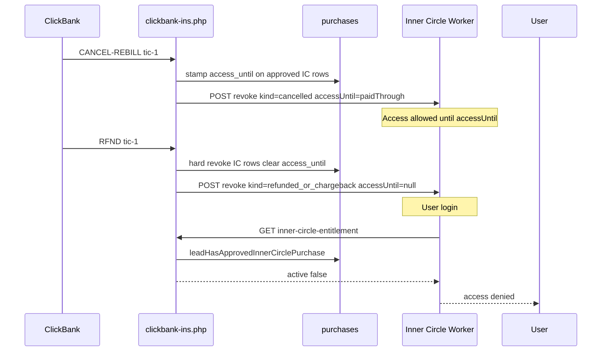

# Inner Circle Worker integration

The Inner Circle chat runs on a Cloudflare Worker (`inner-circle-luna`). This PHP app is the source of truth for purchase entitlement. After deploying the INS revocation changes in this repo, update the Worker as follows.

## Environment variables (Worker)

| Variable | Purpose |
| --- | --- |
| `HMAC_SECRET` | Same value as PHP `IC_HMAC_SECRET` (token minting + revoke webhook verification) |
| `ENTITLEMENT_API_URL` | e.g. `https://soulmirrorreading.com/api/inner-circle-entitlement` |
| `ENTITLEMENT_SECRET` | Same value as PHP `IC_ENTITLEMENT_SECRET` (or `IC_HMAC_SECRET` if shared) |

## Environment variables (PHP)

| Variable | Purpose |
| --- | --- |
| `IC_HMAC_SECRET` | HMAC for activation tokens and revoke webhook signature |
| `IC_ENTITLEMENT_SECRET` | HMAC for entitlement API (defaults to `IC_HMAC_SECRET`) |
| `IC_REVOKE_WEBHOOK_URL` | Worker endpoint that receives revoke POSTs, e.g. `https://inner-circle-luna.inner-circle.workers.dev/api/revoke` |

## 1. Entitlement check on login

Before granting email login or honoring a gating token, call:

```
GET {ENTITLEMENT_API_URL}?email={urlencoded_email}&sig={hex_hmac_sha256(email, ENTITLEMENT_SECRET)}
```

Response:

```json
{ "active": true }
```

Deny access when `active` is `false` or the request fails.

### Reference (Worker / TypeScript)

```typescript
async function isInnerCircleActive(email: string, env: Env): Promise<boolean> {
  const normalized = email.trim().toLowerCase();
  const sig = await hmacSha256Hex(normalized, env.ENTITLEMENT_SECRET);
  const url = `${env.ENTITLEMENT_API_URL}?email=${encodeURIComponent(normalized)}&sig=${sig}`;
  const res = await fetch(url, { method: 'GET' });
  if (!res.ok) return false;
  const body = (await res.json()) as { active?: boolean };
  return body.active === true;
}

async function hmacSha256Hex(message: string, secret: string): Promise<string> {
  const key = await crypto.subtle.importKey(
    'raw',
    new TextEncoder().encode(secret),
    { name: 'HMAC', hash: 'SHA-256' },
    false,
    ['sign'],
  );
  const sig = await crypto.subtle.sign('HMAC', key, new TextEncoder().encode(message));
  return [...new Uint8Array(sig)].map((b) => b.toString(16).padStart(2, '0')).join('');
}
```

## 2. Revoke webhook

PHP `InnerCircleRevocationNotifier` POSTs to `IC_REVOKE_WEBHOOK_URL` when ic-1 / ic-1-ds access is revoked:

**Headers:** `Content-Type: application/json`, `X-IC-Signature: {hex_hmac_sha256(raw_json_body, HMAC_SECRET)}`

**Body:**

```json
{
  "email": "buyer@example.com",
  "reason": "cancelled",
  "receipt": "ABC12345"
}
```

Verify `X-IC-Signature` with the same HMAC key, then delete stored activation/session for that email in KV or D1.

### Reference (Worker route)

```typescript
export async function handleRevoke(request: Request, env: Env): Promise<Response> {
  const bodyText = await request.text();
  const signature = request.headers.get('X-IC-Signature') ?? '';
  const expected = await hmacSha256Hex(bodyText, env.HMAC_SECRET);
  if (!timingSafeEqual(signature, expected)) {
    return new Response('Forbidden', { status: 403 });
  }

  const payload = JSON.parse(bodyText) as { email?: string };
  const email = (payload.email ?? '').trim().toLowerCase();
  if (!email) return new Response('Bad Request', { status: 400 });

  await env.IC_ACTIVATIONS.delete(email);
  return new Response('ok', { status: 200 });
}
```

## 3. Optional periodic re-check

Re-call the entitlement API on each chat session start (or every N minutes) so access is removed even if the revoke webhook was missed.

## Flow

Cancel alone is a **soft cancel**: remaining approved TIC-1 / IC rows keep access until `access_until`. Refunds and chargebacks are **hard revokes**: access ends immediately and the Worker is told to drop the session (`accessUntil: null`), even if the RFND upsert alone cleared the last approved row.


